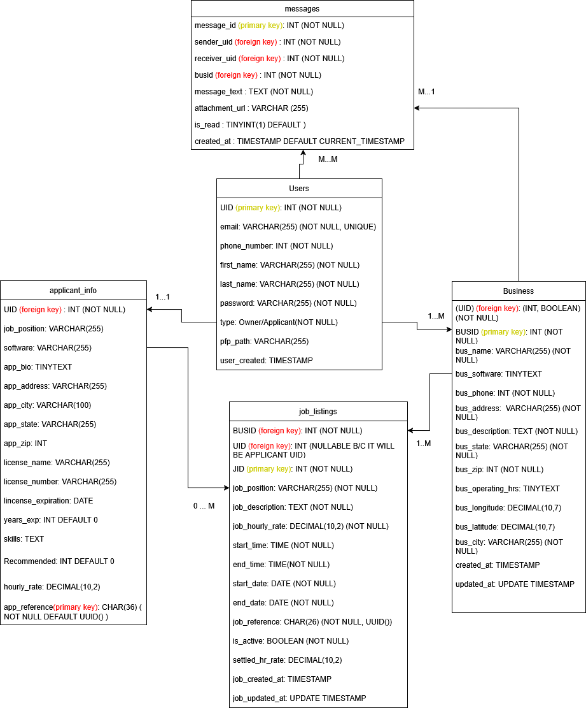

# Start Stafee App 

## Start VS Code.  

## Clone repository from:
https://github.com/alrudniy/staffee-s25.git


## Create a new virtual environment:
python -m venv venv

## Activate the Virtual Environment:
### On Windows:
venv\Scripts\activate
### On macOS/Linux:
source venv/bin/activate

## Install Dependencies. With the virtual environment active, install your project’s dependencies from your requirements.txt.
pip install -r requirements.txt

**Overview**
The purpose of the Staffee mobile application is to allow applicants to connect with pharmacy owners for employment purposes. Development of this project was undertaken utilizing [Beeware](https://beeware.org/), a collection of Python native cross platform tools. 

In order to run the project with briefcase (android) in terminal:
```
1. Ensure you are in the child folder of staffee (if not -> run 'cd staffee')
2. 'briefcase create android' -> briefcase downloads java JDK + android SDK
3. 'briefcase build android' -> briefcase build command compiles project to into android APK app file
4. 'briefcase run android' -> runs the application 
```
For further instructions, refer to [briefcase mobile platform section](https://docs.beeware.org/en/latest/tutorial/tutorial-5/index.html).

Link to database [here](http://34.125.69.91/phpmyadmin/index.php).

Database diagram/schema (As currently implemented within project): 

Project details provided by client: 
    1.[Figma diagram](https://www.figma.com/design/BH4zKZT1vfGf5plBEAAiHb/Staffee-Project).
    2.[Product guide](https://guide.staffee.ca/english)

# TODO
```
[ ] Define a designated home page for both applicant/owner (no clear path that distingushes after login recongition of owner and applicant)
[ ] Need to test mobile application for iOS in order to ensure widget defintion (size, formatting) remain as defined in Android mobile application
[ ] Features with no work completed (buttons with no action): Home, Notification, New Job, Calendar
[ ] Features with work started (implemented into application, not fully defined/needs work): Chat, Account, owner_view_staff.py
[ ] EASY: include UUID library to generate a reference to each applicant, the same should be done when a new job is listed by the owner. Ensure that it gets added to sql query within program in order correctly insert instances to table.
```
